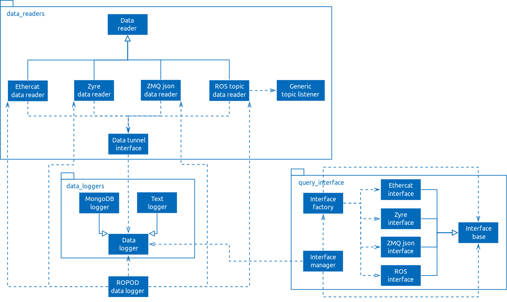

# Black Box

## Introduction

This repository is a collection of components for a robotic black box, which is a device that logs data from different data sources and exposes a query interface for the data.

The black box has two major components:
* `data logger`: A set of interfaces for reading data from different data sources and logging those data
* `query_interface`: An interface for black box data retrieval

Both the logger and the query interface are exposed in both Python and C++; the Python versions are generally more up-to-date than the C++ versions. Note: We develop and test under Python 3; there are no plans for backwards compatibility with Python 2.

## Black Box Design Principles

The main design principles of our robotics black box are:
* standard data format
* data filtering
* configurability

Our black box design principles were initially introduced in

A. Mitrevski, S. Thoduka, A. Ortega Sáinz, M. Schöbel, P. Nagel, P. G. Plöger, and E. Prassler, "Deploying Robots in Everyday Environments: Towards Dependable and Practical Robotic Systems," in 29th International Workshop on Principles of Diagnosis (DX), Warsaw, Poland, 2018

which have however evolved in a few respects since that paper was published.

### Data Format

The black box stores data in a standard format, such that
1. **logged data are always associated with a timestamp** and
2. **all data types are logged in a nested manner that reflects the underlying data type** (in the original version of the black box introduced in the above paper, data were logged at a single level of abstraction, i.e. in an unrolled manner, but we've abandoned that design since it required manual conversion of data to the standard format, which was inconvenient particularly in the case of logging ROS messages).

This is best illustrated by an example. If we want to log a ROS topic of type [geometry_msgs/Pose](http://docs.ros.org/lunar/api/geometry_msgs/html/msg/Pose.html), which is defined as

```
geometry_msgs/Point position
    float64 x
    float64 y
    float64 z
geometry_msgs/Quaternion orientation
    float64 x
    float64 y
    float64 z
    float64 w
```

the logged data will have the following format:

```
double timestamp
position
    double x
    double y
    double z
orientation
    double x
    double y
    double z
    double w
```

The black box uses a MongoDB database for logging data, such that each data type is stored in a separate collection and data items belonging to that data type are stored in separate documents for each time step. In the above example, the items of the geometry_msgs/Pose message will be stored in a collection named `ros_topic-name`, where `topic-name` is the name of the logged ROS topic, `ros` describes the data source (in this case ROS) and, by convention, the `_` separates the data source and data type names. The full names of the logged variables will thus be

```
ros_cmd_vel/timestamp
ros_cmd_vel/position/x
ros_cmd_vel/position/y
ros_cmd_vel/position/z
ros_cmd_vel/orientation/x
ros_cmd_vel/orientation/y
ros_cmd_vel/orientation/z
ros_cmd_vel/orientation/w
```

The full names of the variables are the ones we use for querying data.

### Data Filtering and Configurability

In order to deal with data that come from different sources (e.g. ROS, EtherCAT, Zyre) and have different formats, each data source is associated with its own data filter that converts the data into the previously described standard format and allows data preprocessing/filtering. These filters are configured through a configuration file, an example of which can be found in [config/data_sources.yaml](config/data_sources.yaml).

### Query Interface

Data from the black box can be retrieved through a Zyre-based query interface that listens to JSON messages and responds back with JSON messages. The following message types can be sent to the query interface:
* variable query: returns a list of all variables logged on a particular black box (schema defined in [docs/messages/black-box-variable-query-schema.json](docs/messages/black-box-variable-query-schema.json))
* data query: returns data corresponding to a set of variables in a given time interval (schema defined in [docs/messages/black-box-data-query-schema.json](docs/messages/black-box-data-query-schema.json))

## Dependencies

The C++ black box components depend on the following libraries:
* [`ropod_common`](https://github.com/ropod-project/ropod_common)
* `yaml-cpp`
* Several ROS components: `roscpp`, `topic_tools`, `std_msgs`, `geometry_msgs`, `nav_msgs`, and `sensor_msgs`
* `jsoncpp`
* `MongoDB` and the `MongoDB C++` driver
* `zyre`
* `zmq`
* `libtins`
* `pthread`

The Python components depend on the following packages:
* The [`Pyre base communicator`](https://github.com/ropod-project/ropod_common/tree/master/pyropod/ropod/pyre_communicator) in `ropod_common`
* `PyYAML`
* `pymongo`

The logger additionally depends on:
* `rospy`
* [`rospy_message_converter`](https://github.com/ropod-project/rospy_message_converter) (a slightly customised version so that it works with Python 3)

## Class diagrams (C++)

A UML-like diagram of the major data logger components is given below; the diagram is not exactly UML because the boxes contain more casual versions of the actual class names.



## Usage (Python)

The black box functionalities are exposed through a `black_box` package that contains two subpackages - `datalogger` and `query interface`. To install the package, run the command

```
python3 setup.py install
```

or, if only development setup is desired,

```
python3 setup.py develop
```

inside the `pybb` directory.

Inside this same directory, there are two executable scripts for the data logger and the query interface.

### Data logger

To start the data logger, run

```
python3 logger_main.py [black-box-database-name]
```

inside the `pybb` directory.

### Query interface

To use the query interface, run

```
python3 query_interface_main.py [absolute-path-to-a-black-box-config-file]
```

inside the `pybb` directory.

## Compilation and Usage (C++)

The two major black box components - the data logger and the query interface - are compiled separately.

### Data logger

To compile the data logger, run the following commands:

```
cd cppbb/datalogger
mkdir build && cd build && cmake ..
make
```

This will create one library - `libdatalogger.so` - and an executable `black_box_logger`.

To launch the data logger, run the command

```
./black_box_logger [absolute-path-to-black-box-config-file]
```

inside the previously created `build` directory.

### Query interface

To compile the query interface, run the following commands:

```
cd cppbb/query_interface
mkdir build && cd build && cmake ..
make
```

This will create one library - `libdata_query_interface.so` - and an executable `black_box_query_interface`.

To launch the component monitors, run the command

```
./black_box_query_interface [absolute-path-to-a-black-box-config-file]
```

inside the previously created `build` directory.
